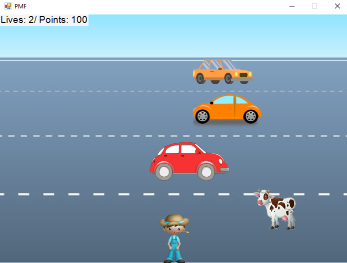

# OTTER Game Engine - 2D Crossy Road Style Game

A simple 2D game engine built in C# with Windows Forms, featuring a Frogger/Crossy Road inspired gameplay where a farmer collects animals while avoiding cars.



## Game Description

Control a farmer who must cross a busy road to collect farm animals (cats, chickens, cows, pigs) while avoiding traffic. The game features:
- Score tracking (collect animals for points)
- Lives system (lose lives when hit by cars)
- Win condition: Reach 800 points
- Lose condition: Run out of lives

## Technical Details

**Technology Stack:**
- C# (.NET Framework 4.8)
- Windows Forms
- Custom sprite/collision system

**Key Features:**
- Custom 2D game engine ("OTTER")
- Sprite management system
- Collision detection
- Event-driven architecture
- Multi-threaded script execution

## Project Structure

```
otter-2d-game-engine/
├── src/                    # Source code
│   ├── BGL.cs             # Main game form and rendering
│   ├── GameClass.cs       # Core game logic
│   ├── Sprite.cs          # Sprite base class
│   ├── Farmer.cs          # Player character
│   ├── Animal.cs          # Animals (collectibles)
│   ├── Car.cs             # Cars (obstacles)
│   ├── Sensing.cs         # Input handling
│   └── Properties/        # Assembly info
├── assets/
│   ├── sprites/           # Game sprites (PNG)
│   └── backgrounds/       # Background images (JPG)
└── README.md
```

## Getting Started

### Prerequisites
- Visual Studio 2019 or later
- .NET Framework 4.8

### Building the Project
1. Open `src/OTTER.sln` in Visual Studio
2. Restore NuGet packages (if any)
3. Build solution (F6)
4. Run (F5)

### Controls
- Arrow keys / WASD to move the farmer
- Collect animals to gain points
- Avoid cars to preserve lives

## Game Rules

- **Animals** (Cat, Chicken, Cow, Pig): +100 points each
- **Cars**: Collision causes loss of life
- **Win**: Reach 800 points
- **Lose**: Lives reach 0

## Code Architecture

The engine uses a Scratch-like approach with:
- **Scripts**: Methods that run in parallel using Tasks
- **Sprites**: Game objects with position, costume, and collision
- **Event Loop**: Continuous rendering and update cycle

Example script pattern:
```csharp
private int MyScript()
{
    while (BGL.START)
    {
        // Game logic here
        Game.WaitMS(100);
    }
    return 0;
}
```

## Notes

- Originally developed as a learning project
- Codebase has been translated to English for better accessibility
- Designed for educational purposes to understand game engine fundamentals
- XML documentation included for all public APIs

## Future Improvements

Potential enhancements:
- Add sound effects and background music
- Implement difficulty levels
- Add more obstacle types
- Create level progression system
- Improve graphics and animations
- Add power-ups and special abilities

## License

This project is provided as-is for educational purposes.

## Contributing

This is a learning project. Feel free to fork and experiment!

---

**Note**: This is a student project created for learning C# game development concepts. The code may not follow all production best practices but demonstrates fundamental game engine architecture.
